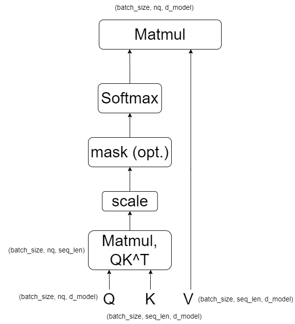
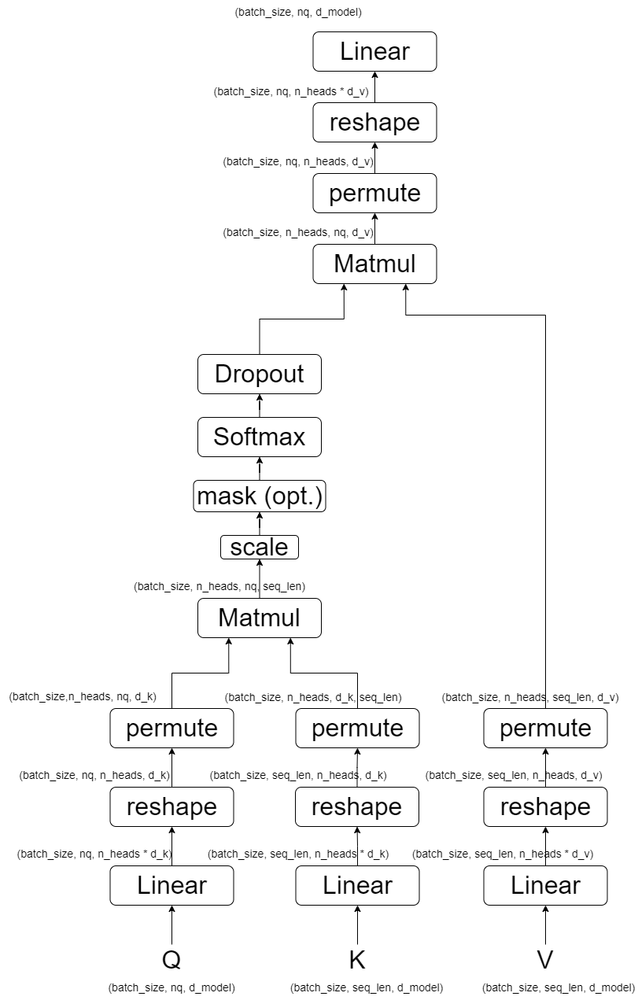

# 说明
这是一个记录所学习模块的仓库，实现了学习的深度学习模块，做到即插即用。

## 注意力模块

* [SelfAttention](https://arxiv.org/abs/1706.03762)

Scaled Dot-Product Attention


Multi-Head Attention


```python
from attention.SelfAttention import ScaledDotProductAttention, MultiHeadAttention
import torch

query = torch.randn(50, 20, 512)
key = torch.randn(50, 49, 512)
value = torch.randn(50, 49, 512)

sdpa = ScaledDotProductAttention(dropout=0.2)
mha = MultiHeadAttention(d_model=512, d_k=512, d_v=256, n_heads=8)

output_sdpa = sdpa(query, key, value)
output_mha = mha(query, key, value)

print(output_sdpa.shape)
print(output_mha.shape)
```


## 卷积模块

