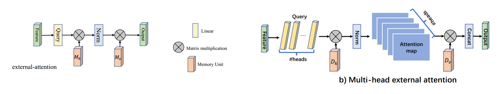

# 说明
这是一个记录所学习模块的仓库，实现了学习的深度学习模块，做到即插即用。

## 注意力模块

### 1. Self-Attention

#### 引用

https://arxiv.org/abs/1706.03762

Vaswani A, Shazeer N, Parmar N, et al. Attention is all you need[J]. Advances in neural information processing systems, 2017, 30.

#### 模型结构


#### 使用方法

```python
from attention.SelfAttention import ScaledDotProductAttention, MultiHeadAttention
import torch

query = torch.randn(50, 20, 512)
key = torch.randn(50, 49, 512)
value = torch.randn(50, 49, 512)

sdpa = ScaledDotProductAttention(dropout=0.2)
mha = MultiHeadAttention(d_model=512, d_k=512, d_v=256, n_heads=8)

output_sdpa = sdpa(query, key, value)
output_mha = mha(query, key, value)

print(output_sdpa.shape)  # [50, 20, 512]
print(output_mha.shape)  # [50, 20, 512]
```

### 2. Simplified Self-Attention

#### 使用方法

```python
from attention.SimplifiedSelfAttention import MultiHeadSimplifiedSelfAttention
import torch

query = torch.randn(50, 20, 512)
key = torch.randn(50, 49, 512)
value = torch.randn(50, 49, 512)

mhssan = MultiHeadSimplifiedSelfAttention(d_model=512, n_heads=8)

out = mhssan(query, key, value)

print(out.shape)  # (50, 20, 512)
```

### 3. External Attention

#### 引用

https://arxiv.org/abs/2105.02358

Guo M H, Liu Z N, Mu T J, et al. Beyond self-attention: External attention using two linear layers for visual tasks[J]. IEEE Transactions on Pattern Analysis and Machine Intelligence, 2022, 45(5): 5436-5447.

#### 模型结构



#### 使用方法

```python
from attention.ExternalAttention import ExternalAttention, MultiHeadExternalAttention
import torch

x = torch.randn(3, 49, 512)
ea = ExternalAttention(d_model=512, S=64)
mhea = MultiHeadExternalAttention(d_model=512, n_heads=4, coef=4, S=64)

output_ea = ea(x)
output_mhea = mhea(x)

print(output_ea.shape)  # (3, 49, 512)
print(output_mhea.shape)  # (3, 49, 512)
```

### 4. Squeeze-and-Excitation Attention (SEAttention)

#### 引用

https://arxiv.org/abs/1709.01507

Hu J, Shen L, Sun G. Squeeze-and-excitation networks[C]//Proceedings of the IEEE conference on computer vision and pattern recognition. 2018: 7132-7141.

#### 模型结构


#### 使用方法

```python
from attention.SEAttention import SEAttention
import torch

x = torch.randn(16, 256, 7, 7)
se = SEAttention(in_channels=256, reduction=8)
output = se(x)
print(output.shape) # [16, 256, 7, 7]
```

### 5. Selective Kernel Attention (SKAttention)
#### 引用
https://arxiv.org/abs/1903.06586

Li X, Wang W, Hu X, et al. Selective kernel networks[C]//Proceedings of the IEEE/CVF conference on computer vision and pattern recognition. 2019: 510-519.

#### 模型结构


#### 使用方法

```python
from attention.SKAttention import SKAttention
import torch

x = torch.randn(50, 512, 7, 7)
se = SKAttention(in_channels=512)
output = se(x)
print(output.shape)  # (50, 512, 7, 7)
```

### 6. Sim Attention (SimAM)
#### 引用
https://proceedings.mlr.press/v139/yang21o/yang21o.pdf

Yang L, Zhang R Y, Li L, et al. Simam: A simple, parameter-free attention module for convolutional neural networks[C]//International conference on machine learning. PMLR, 2021: 11863-11874.

#### 使用方法

```python
from attention.SimAM import SimAM
import torch

x = torch.randn(3, 64, 7, 7)
model = SimAM()
outputs = model(x)
print(outputs.shape)  # (3, 64, 7, 7)
```


## 卷积模块

### 1. Depthwise Separable Convolution

#### 引用

https://arxiv.org/abs/1610.02357

Chollet F. Xception: Deep learning with depthwise separable convolutions[C]//Proceedings of the IEEE conference on computer vision and pattern recognition. 2017: 1251-1258.

#### 使用方法

```python
from conv.DepthwiseSeparableConv2d import DepthwiseSeparableConv2d
import torch

x = torch.randn(2, 3, 224, 224)
dsconv = DepthwiseSeparableConv2d(3, 64, kernel_size=3, stride=2)
out = dsconv(x)
print(out.shape)  # [2, 64, 112, 112]
```

### 2. Heterogeneous Convolution

#### 引用

https://arxiv.org/pdf/1903.04120.pdf

Singh P, Verma V K, Rai P, et al. Hetconv: Heterogeneous kernel-based convolutions for deep cnns[C]//Proceedings of the IEEE/CVF conference on computer vision and pattern recognition. 2019: 4835-4844.

#### 使用方法

```python
from conv.HeterogeneousConv2d import HetConv2d
import torch

x = torch.rand(1, 16, 224, 125)
conv = HetConv2d(16, 64, p=4)
out = conv(x)
print(out.shape)  # [1, 64, 224, 125]
```

